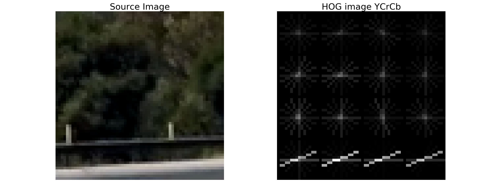

# Vehicle Detection and Tracking

Vehicle detection and tracking in a video-feed.


## Overview

This project is part of [Udacity's Self-Driving Car Nanodegree program](https://www.udacity.com/drive)
and much of the source comes from the program's lecture notes and quizzes.

Following steps were performed to setup the vehicle detection and tracking
pipeline for a video-feed obtained from a front-facing camera.

1. Data collection
2. Feature selection: Histogram of Oriented Gradients, spatial-bins
and color-histogram.
3. Training the classifier to detect cars
4. Sliding window search to find cars in an image
5. Video implementation with bounding boxes on detections


## Dependencies
1. Python-3.5
2. OpenCV-Python
3. Moviepy
4. Numpy
5. Matplotlib
6. Pickle


## Directory Layout
* src : Contains the following source files.
  * vehicle_detection.py : Contains the detection and tracking pipeline, runs
  the pipeline against an input video.
  * vehicle_classifier.py : Trains the SVM classifier with features extracted
  from the dataset available in training_images/ directory.
  * tracking_util.py : Contains utility methods such as feature-extraction,
  finding sliding-windows/vehicles, etc.
  * vis_util.py : Sample methods for visualizing different stages of the pipeline.
  * pickle_images.py : Serializes train-dataset images by storing their numpy-array
   representation in a pickle-file.
* training_images : Train dataset containing vehicle and non-vehicle images.
* test_images : Images to test different stages of the detection pipeline.
* output_images : Output from pipeline stages run on test-images.
* detected_video.mp4 : Output from the detection pipeline run on the input video.
* model.p : Pickled SVM classifier model.


## Running the car detection and tracking pipeline
Switch to the source directory and run the vehicle-detection script.
This will take the video (project_video.mp4)[project_video.mp4]
as input, runs the detection/tracking pipeline on it, and finally saves the output
to [detected_vehicles.mp4](detected_vehicles.mp4) in the parent directory.
```bash
cd src
python vehicle_detection.py
```


## Vehicle detection and tracking pipeline description
Let's go through the steps in the pipeline listed above. Please note that rest
of this document refers to the source in `src/` directory.


### Data collection
Labeled images containing [vehicles](https://s3.amazonaws.com/udacity-sdc/Vehicle_Tracking/vehicles.zip)
and [non-vehicles](https://s3.amazonaws.com/udacity-sdc/Vehicle_Tracking/non-vehicles.zip)
provided by Udacity were collected. These images were selected from
[GTI vehicle image database](http://www.gti.ssr.upm.es/data/Vehicle_database.html)
and [KITTI vision benchmark suite](http://www.cvlibs.net/datasets/kitti/).

Numpy arrays of the collected images was pickled for reuse. Script
`pickle_images.py` performs this routine, saving the pickled file in `image_data.p`
in the parent directory.
```bash
cd src
python pickle_images.py
```

- Number of vehicle train images: 6941
- Number of non-vehicle train images: 8968

Sample images present in the dataset:


### Feature selection:  Histogram of Oriented Gradients (HOG)
Histogram of Oriented Gradients (HOG) features of positive (image containing cars)
and negative (image not containing cars) is considered, along with spatial-bin
and color histogram features. Methods `extract_features()` and `get_hog_features()`
in tracking_util.py find the HOG features in an image, by using scikit-learn's
`hog()` method.

Following parameters were used while extracting the features from the training
dataset. These are available in the value object class `FeatureParams` inside
vehicle_classifier.py. Trial and error approach was taken to choose and fine-tune
the parameters.

|Parameter|Value|
|:-------:|:---:|
|Color Space|YCrCb|
|HOG Orientations|8|
|HOG Pixels per cell|16|
|HOG Cells per block|4|
|HOG Channels|All|
|Spatial bin size| (32,32)|
|Number of Histogram bins|32|

Sample HOG images in YCrCb color-space. Below images show that the HOG features
of images containing cars is different from ones not having cars.





### Training the classifier
Classifier training routine is present in vehicle_classifier.py. Following steps,
in brief, are taken during this routine as available in the `train()` method.

* Features of positive and negative samples are extracted.
* Feature vectors (X) is created by stacking together positive and negative
features. Here, negative to positive features ratio is 3:1 since the number of
negative features that is obtained in the project-video is fairly bigger than
the positive features.
* Labels (y) corresponding to feature vectors is created.
* For training the classifier, we split the dataset by assigning 20% of it to
a test-set, with the remaining 80% used as train-set.
* Feature-scaling is applied on the train-set using a StandardScaler(). This
scaler subsequently scales the feature-vectors of test-set and other unseen images.
* A **Linear SVM classifier** is chosen to classify vehicles and non-vehicles.

Accuracy of the classifier on test-set: 0.997


### Sliding window search
To detect cars in an image, a sliding-window search approach is taken. Here we
slide a window of a given size across the image, extracting the features within
the window and running the classifier on the window-features to classify vehicles
and non-vehicles. In tracking_util.py, method `slide_window()` gets the windows
and `search_car_windows()` searches for cars in a given window.

Window size chosen is 96x96 pixels as this was found to be a sufficient size for
finding cars. To reduce the number of false-positives occuring from pixels
falling outside the road, the search area is limited to [100,1180] along
x-dimension and [400,700] along y-dimension. Overlap percentage for the sliding
windows is set to 70%. This window-overlap makes use of the large number of (positive)
features found around cars, hence reliably increasing the probability of its
detection.

Below images show the detections following a sliding-window search.
Note that not all detections contain cars.

|Test image|Car detections|
|:--------:|:------------:|
|||
|||
|||
|||
|||
|||


### Video implementation with bounding boxes on detections

Car detections obtained from the above step are clubbed together into a heatmap
of boxes i.e. detected-boxes in vicinity are  into one single box, where
we apply a `heatmap-threshold` to filter out the boxes falling under a given
threshold. This is implemented in `add_heat()` and `apply_threshold()` methods
in tracking_util.py.

|Test image|Car heatmap|
|:--------:|:------------:|
|||
|||
|||
|||
|||
|||

Once we get the thresholded heatmap, we draw bounding boxes around the heatmap
using `scipy.ndimage.measurements label()` method. This returns the number
of bounding boxes and the coordinates of bounding-boxes. Method `draw_bboxes()`
in tracking_util.py performs this step.

|Test image|Bounding box image|
|:--------:|:------------:|
|||
|||
|||
|||
|||
|||

Note that there are still few false-positive predictions where either non-car
pixels are classified as cars or car pixels are not classified as cars. We
partially remove this by accumulating a number of heatmap windows i.e.
*hot-windows* using `HotWindows` class in vehicle_detection.py. The idea behind
this is to make use of the hot-windows for image-frames, which more or less
would be the same if it falls under the video frame rate ~30 Hz. We add the
hot-windows found in an image-frame to a list of existing hot-windows. While
drawing the bounding boxes representing car-detections in the image, we threshold
the number of hot-windows, currently set to 33, proportional to the frame-rate.

Above pipeline steps are run against the input video
[project_video.mp4](project_video.mp4) and the output is saved in
[detected_vehicles.mp4](detected_vehicles.mp4)


### Discussion

This work has lots of room for improvement, some of which are noted below.

1. Classifier training : Hard-negative mining could be used to reduce
false-positives, where we record (negative) features which were classified to
be positive and (re)train the classifier using hard-negative samples.

2. Sliding window search with varying window sizes for target-objects (cars) at
near and far distances would make the classification robust.

3. There's also a limitation where vehicles at steep curve or near the horizon
may not be detected since the pipeline looks for vehicles in a given xy-region.

4. Alternatives to HOG + Linear SVM classifier could be used to fasten the rate
of detection. With the current pipeline, it stands at about 1.4 FPS as given by
the it/s (iterations per second) output given by Moviepy while writing to the
output video file. I strongly believe that recent popular deep-learning methods
like [YOLO](https://arxiv.org/abs/1506.02640),
[Single Shot Multibox Detector](https://arxiv.org/abs/1512.02325) would make
the classification robust.
